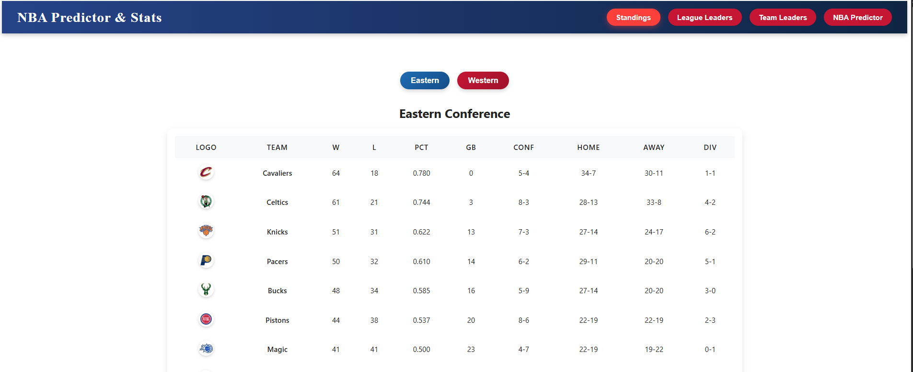
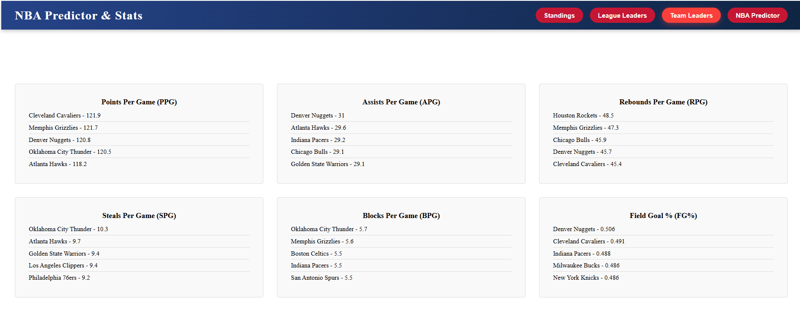
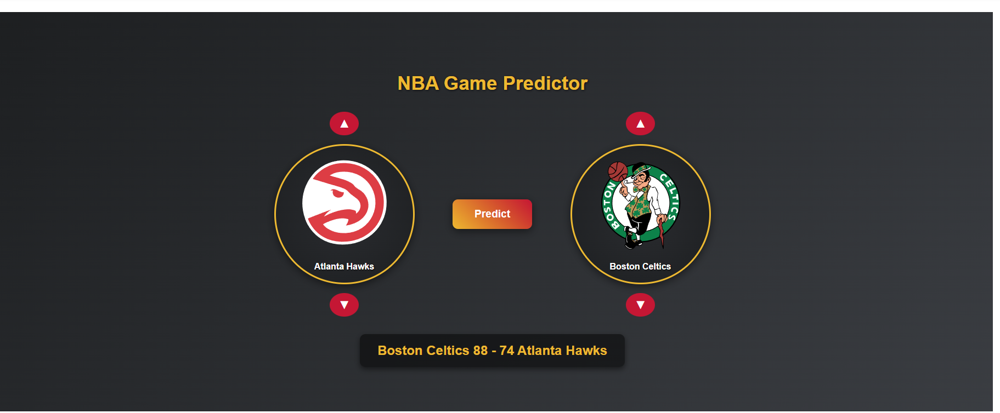

<h1 align="center">🏀 NBA Stats & AI Game Predictor</h1>

  A full-stack web app that combines live NBA statistics with AI-powered game score prediction.  
  Built with <strong>Angular</strong>, <strong>ASP.NET Core</strong>, <strong>Python (nba_api)</strong>, and a custom-trained <strong>Machine Learning</strong> model.

---

## 📌 Features

✅ **NBA Standings** – current standings for all teams  
✅ **NBA League Leaders** – top players in the league by various stats  
✅ **NBA Team League Leaders** – top teams in the league by various stats 

✅ **AI Game Predictor** – select 2 teams and get predicted scores for both sides  

---

## 🛠️ Tech Stack

| Layer          | Technology |
|----------------|------------|
| **Frontend**   | Angular    |
| **Backend**    | ASP.NET Core |
| **API & Data** | Python, nba_api |
| **AI Model**   | Scikit-learn, Pandas, NumPy |
| **Data Format**|  JSON |
---
## 📸 Screenshots

   
  <em>League Table</em>

   
  <em>Team Stats</em>

   
  <em>Predictor</em>

---
